<p align="center">
  
</p>

# 🚀 Awesome Virtual Private Cloud (VPC) Networking & Cloud Isolation Ecosystem 🌐

<p align="center">
  <a href="https://github.com/ishandutta2007/Awesome-Awesome-Awesome"></a><a href="https://discord.gg/jc4xtF58Ve"></a> [](https://github.com/ishandutta2007/Awesome-Awesome-Awesome) [](https://creativecommons.org/publicdomain/zero/1.0/) <a href="https://github.com/ishandutta2007"></a>
</p>

> **A curated showcase of commercial SaaS VPC platforms ☁️, self-hosted Overlay Networks 🛡️, Software-Defined Networking (SDN) controllers ⚡, eBPF CNIs 🐝, and Infrastructure as Code (IaC) tools 🛠️.**  
> *Engineered for Cloud Architects 🏗️, Site Reliability Engineers (SREs) ⚙️, Network Engineers 🔌, and DevOps teams seeking network isolation and multi-cloud sovereignty.*

🗓️ **Last updated: October 2026**

---

## 📖 Overview & SEO Guide

**Virtual Private Cloud (VPC) Networking** 🔒 is the core foundational layer of cloud security architecture. It provides isolated virtual networks, subnetting, custom routing, security group firewalls, overlay encryption (WireGuard, IPsec), and gateway routing across public clouds and self-hosted environments.

This repository catalogs top **commercial VPC cloud providers** 🏛️ alongside **open-source networking projects** 🔓, categorized and sorted by company valuation/market cap and GitHub community traction (Stars_Count).

### 🏷️ Key Keywords & Topics Covered
`virtual-private-cloud` • `vpc-networking` • `cloud-networking` • `overlay-network` • `software-defined-networking` • `ebpf` • `wireguard-vpn` • `kubernetes-cni` • `multi-cloud-networking` • `zero-trust-network`

---

## 📋 Table of Contents
- [☁️ SaaS & Commercial VPC Platforms](#%EF%B8%8F-saas--commercial-vpc-platforms)
- [🔓 Open-Source GitHub Projects (Sorted by Stars)](#-open-source-github-projects-sorted-by-stars)
- [🏗️ Frameworks for Custom VPC Architecture](#%EF%B8%8F-frameworks-for-custom-vpc-architecture)
- [🤝 How to Contribute](#-how-to-contribute)
- [⚠️ Disclaimer & Security Considerations](#%EF%B8%8F-disclaimer--security-considerations)
- [💖 Support & Community](#-support--community)
- [📈 Star History](#-star-history)

---

## ☁️ SaaS & Commercial VPC Platforms

> [!NOTE]
> 📊 **Market Size & Industry Structure**: The global Virtual Private Cloud (VPC) & Cloud Networking market is estimated at **$14.2 Billion to $38.5 Billion** (within the broader $1.1+ Trillion cloud infrastructure market) growing at a **16% – 22% CAGR**. The sector exhibits **high market concentration at the top** (hyperscalers AWS, Microsoft Azure, and Google Cloud control over **65% of global cloud infrastructure**), while remaining **moderately fragmented across specialized cloud providers** (DigitalOcean, Linode, Hetzner, Scaleway) and third-party multi-cloud overlay network vendors.

| Provider / Platform | 🏢 Company Valuation / Market Cap | 💵 Starting Tier Pricing | 🎁 Free Tier / Free Trial Limit | 🎯 Core Strengths & Use Cases |
| :--- | :--- | :--- | :--- | :--- |
| **[Azure Virtual Network](https://azure.microsoft.com/en-us/products/virtual-network/)** 🔷 | **$3.30 Trillion** *(Microsoft Corp.)* | Free base VNet creation; NAT Gateway $0.045/hr + $0.045/GB; VNet Peering $0.01/GB | $200 free credit (30 days) + 100 GB/mo outbound data transfer free forever | Enterprise hybrid cloud, native integration with Azure services, NSGs, and ExpressRoute |
| **[Amazon VPC](https://aws.amazon.com/vpc/)** 🟧 | **$3.05 Trillion** *(Amazon.com, Inc.)* | Free base VPC creation & route tables; NAT Gateway $0.045/hr + $0.045/GB; Public IPv4 $0.005/hr | $200 free credit for new users + 100 GB/mo outbound data transfer free across services | Industry-standard public cloud VPC, maximum ecosystem tooling, Transit Gateway |
| **[Google Cloud VPC](https://cloud.google.com/vpc)** 🔴 | **$2.50 Trillion** *(Alphabet Inc.)* | Free base VPC network creation; Cloud NAT $0.045/hr + $0.045/GB; Inter-zone data $0.01/GB | $300 free trial credit (90 days) + 100 GB/mo egress free to most worldwide destinations | Global single-VPC architecture, Shared VPC multi-project governance, native Andromeda SDN |
| **[Alibaba Cloud VPC](https://www.alibabacloud.com/product/vpc)** 🟧 | **$240.00 Billion** *(Alibaba Group)* | Free base VPC & subnet creation; NAT Gateway $0.057/hr + $0.035/GB data processing fee | $300–$1,000 free trial credits for new enterprise accounts valid for 30–60 days | Enterprise isolation optimized for Asia-Pacific cross-border cloud infrastructure |
| **[Linode Cloud VPC](https://www.linode.com/products/vpc/)** 🟢 | **$15.00 Billion** *(Akamai Technologies)* | Free VPC network creation & subnets; Compute instances start at $5.00/mo (1 GB RAM, 1 TB transfer) | $100 free credit valid for 60 days for all new customer registrations | Developer-friendly cloud infrastructure with zero-cost private network segment isolation |
| **[Scaleway Private Networks](https://www.scaleway.com/en/vpc/)** 🟣 | **$15.00 Billion** *(Iliad Group)* | Free up to 8 Private Networks per region; Managed NAT Gateway €0.012/hr (~$8.90/mo); Compute €0.0075/hr | €100 (~$110) free credit valid for 30 days for new user sign-ups | European data sovereignty-focused VPC with isolated private network attachments |
| **[DigitalOcean VPC](https://www.digitalocean.com/products/vpc)** 🌊 | **$3.50 Billion** *(DigitalOcean Holdings)* | Free automatic VPC creation & intra-VPC data transfer; Droplet instances start at $4.00/mo | $200 free credit valid for 60 days for all new accounts | Simple, zero-configuration private networking between Droplets within the same region |
| **[OVHcloud vRack](https://www.ovhcloud.com/en/network/vrack/)** 🔵 | **$1.80 Billion** *(OVH Groupe SAS)* | Free vRack private cross-datacenter interconnection included; Public Cloud from €3.50/mo (~$4.20/mo) | €200 (~$220) free Public Cloud trial credit valid for 1 month | Multi-datacenter private interconnection between Bare Metal, Private Cloud & Public Cloud |
| **[Vultr VPC 2.0](https://www.vultr.com/features/vpc/)** 🟦 | **$1.00 Billion** *(Constant Company LLC)* | Free intra-region VPC 2.0 private networking; Instance pricing starts at $2.50/mo (IPv6) / $3.50/mo (IPv4) | $250 free trial credit valid for 30 days for new user registrations | High-performance regional private networking with instant private IP range allocation |
| **[Hetzner Cloud Networks](https://www.hetzner.com/cloud)** 🔴 | **$500.00 Million** *(Hetzner Online GmbH)* | Free private network attachments; Cloud servers start at €3.29/mo (~$3.60/mo); Primary IPv4 €0.60/mo | €20 free promotional credit / 14-day money-back guarantee for new accounts | Ultra cost-effective European cloud hosting with private IP network isolation |

---

## 🔓 Open-Source GitHub Projects (Sorted by Stars)

Below is the complete curated catalog of open-source VPC, overlay networking, virtual switching, eBPF CNI, and Infrastructure as Code projects, **sorted strictly in descending order by GitHub Stars_Count**.

### **[ansible](https://github.com/ansible/ansible)** [](https://github.com/ansible/ansible/stargazers)

- 📦 **Repository**: [`ansible/ansible`](https://github.com/ansible/ansible)
- 🏷️ **Category**: `Infrastructure as Code & Network Automation 🛠️` | 📜 **License**: `GPL-3.0` | ⭐ **GitHub_Stars**: `★ 70,863`
- 📝 **Description**: **Automation and configuration management platform** for provisioning VPC networks, virtual routers, cloud security groups, and enterprise hardware switches across multi-cloud environments.

---

### **[terraform](https://github.com/hashicorp/terraform)** [](https://github.com/hashicorp/terraform/stargazers)

- 📦 **Repository**: [`hashicorp/terraform`](https://github.com/hashicorp/terraform)
- 🏷️ **Category**: `Infrastructure as Code (IaC) 🏗️` | 📜 **License**: `MPL-2.0 / BSL` | ⭐ **GitHub_Stars**: `★ 49,830`
- 📝 **Description**: **The de facto Infrastructure as Code standard** for declarative provisioning of Virtual Private Clouds, subnets, route tables, internet gateways, and security policies across AWS, Azure, GCP, and custom providers.

---

### **[headscale](https://github.com/juanfont/headscale)** [](https://github.com/juanfont/headscale/stargazers)

- 📦 **Repository**: [`juanfont/headscale`](https://github.com/juanfont/headscale)
- 🏷️ **Category**: `Self-Hosted Overlay Mesh VPN 🛡️` | 📜 **License**: `BSD-3-Clause` | ⭐ **GitHub_Stars**: `★ 44,372`
- 📝 **Description**: **Open-source, self-hosted implementation of the Tailscale control server.** Enables full vendor independence while running official Tailscale clients across custom WireGuard mesh VPC networks.

---

### **[tailscale](https://github.com/tailscale/tailscale)** [](https://github.com/tailscale/tailscale/stargazers)

- 📦 **Repository**: [`tailscale/tailscale`](https://github.com/tailscale/tailscale)
- 🏷️ **Category**: `WireGuard Mesh VPN & Overlay Network 🌐` | 📜 **License**: `BSD-3-Clause (Client)` | ⭐ **GitHub_Stars**: `★ 37,174`
- 📝 **Description**: **Zero-config WireGuard mesh VPN** providing MagicDNS, NAT traversal, granular access control lists (ACLs), and single sign-on (SSO) integration for instant multi-cloud overlay networking.

---

### **[opentofu](https://github.com/opentofu/opentofu)** [](https://github.com/opentofu/opentofu/stargazers)

- 📦 **Repository**: [`opentofu/opentofu`](https://github.com/opentofu/opentofu)
- 🏷️ **Category**: `Infrastructure as Code (Open Source) 🔓` | 📜 **License**: `MPL-2.0` | ⭐ **GitHub_Stars**: `★ 30,393`
- 📝 **Description**: **Community-driven open-source fork of Terraform**, managed under the Linux Foundation. Ideal for declaratively defining VPC subnets, routing, and cloud infrastructure without commercial license restrictions.

---

### **[netbird](https://github.com/netbirdio/netbird)** [](https://github.com/netbirdio/netbird/stargazers)

- 📦 **Repository**: [`netbirdio/netbird`](https://github.com/netbirdio/netbird)
- 🏷️ **Category**: `Zero Trust Overlay Network 🔒` | 📜 **License**: `Apache-2.0` | ⭐ **GitHub_Stars**: `★ 29,763`
- 📝 **Description**: **Open-source Zero Trust networking platform** built on WireGuard. Features automated peer-to-peer overlay mesh generation, identity provider (IDP) integrations, and self-hosted admin dashboard.

---

### **[pulumi](https://github.com/pulumi/pulumi)** [](https://github.com/pulumi/pulumi/stargazers)

- 📦 **Repository**: [`pulumi/pulumi`](https://github.com/pulumi/pulumi)
- 🏷️ **Category**: `Developer Infrastructure as Code 💻` | 📜 **License**: `Apache-2.0` | ⭐ **GitHub_Stars**: `★ 25,760`
- 📝 **Description**: **Infrastructure as Code tool using real programming languages** (TypeScript, Python, Go, C#). Declaratively orchestrate cloud VPCs, network security rules, and subnets in software code.

---

### **[cilium](https://github.com/cilium/cilium)** [](https://github.com/cilium/cilium/stargazers)

- 📦 **Repository**: [`cilium/cilium`](https://github.com/cilium/cilium)
- 🏷️ **Category**: `eBPF Kubernetes CNI & Security 🐝` | 📜 **License**: `Apache-2.0` | ⭐ **GitHub_Stars**: `★ 25,609`
- 📝 **Description**: **The premier eBPF-powered Kubernetes networking, security, and observability project.** Replaces kube-proxy with high-performance eBPF packet routing, multi-cluster VPC mesh, and L7 transparent encryption.

---

### **[nebula](https://github.com/slackhq/nebula)** [](https://github.com/slackhq/nebula/stargazers)

- 📦 **Repository**: [`slackhq/nebula`](https://github.com/slackhq/nebula)
- 🏷️ **Category**: `Scalable Mesh Overlay Network 🌌` | 📜 **License**: `MIT` | ⭐ **GitHub_Stars**: `★ 18,415`
- 📝 **Description**: **Mutually authenticated, zero-trust overlay network** created by Slack. Connects hosts anywhere on the internet with encrypted peer-to-peer IP tunnels and built-in firewall rules.

---

### **[ZeroTierOne](https://github.com/zerotier/ZeroTierOne)** [](https://github.com/zerotier/ZeroTierOne/stargazers)

- 📦 **Repository**: [`zerotier/ZeroTierOne`](https://github.com/zerotier/ZeroTierOne)
- 🏷️ **Category**: `Multi-Cloud Software Defined Network (SDN) ⚡` | 📜 **License**: `BSL 1.1 / Open Source` | ⭐ **GitHub_Stars**: `★ 17,158`
- 📝 **Description**: **Virtual ethernet switch for the whole world.** Creates peer-to-peer virtual local area networks (VLANs) and multi-cloud overlay VPC networks across physical and virtual hosts.

---

### **[cloudflared](https://github.com/cloudflare/cloudflared)** [](https://github.com/cloudflare/cloudflared/stargazers)

- 📦 **Repository**: [`cloudflare/cloudflared`](https://github.com/cloudflare/cloudflared)
- 🏷️ **Category**: `Cloudflare Zero Trust Tunnel Daemon 🚇` | 📜 **License**: `Apache-2.0` | ⭐ **GitHub_Stars**: `★ 16,035`
- 📝 **Description**: **Cloudflare Tunnel client daemon** that connects private VPC network resources directly to Cloudflare's edge network without opening inbound public ports or public IPv4 addresses.

---

### **[gluetun](https://github.com/passteque/gluetun)** [](https://github.com/passteque/gluetun/stargazers)

- 📦 **Repository**: [`passteque/gluetun`](https://github.com/passteque/gluetun)
- 🏷️ **Category**: `Lightweight Network Gateway & VPN Client 🐳` | 📜 **License**: `MIT` | ⭐ **GitHub_Stars**: `★ 15,717`
- 📝 **Description**: **Lightweight Docker container network gateway** supporting WireGuard and OpenVPN protocols. Provides secure network egress isolation and routing for self-hosted container stacks.

---

### **[openvpn](https://github.com/OpenVPN/openvpn)** [](https://github.com/OpenVPN/openvpn/stargazers)

- 📦 **Repository**: [`OpenVPN/openvpn`](https://github.com/OpenVPN/openvpn)
- 🏷️ **Category**: `Enterprise Virtual Private Network 🔑` | 📜 **License**: `GPL-2.0` | ⭐ **GitHub_Stars**: `★ 14,643`
- 📝 **Description**: **The industry-standard open-source SSL/TLS VPN daemon.** Securely bridges remote clients and enterprise branch offices directly into private VPC network subnets.

---

### **[netmaker](https://github.com/gravitl/netmaker)** [](https://github.com/gravitl/netmaker/stargazers)

- 📦 **Repository**: [`gravitl/netmaker`](https://github.com/gravitl/netmaker)
- 🏷️ **Category**: `WireGuard Multi-Cloud Overlay VPC 🚀` | 📜 **License**: `Apache-2.0` | ⭐ **GitHub_Stars**: `★ 11,819`
- 📝 **Description**: **Leading open-source platform for WireGuard-based Zero Trust overlay networks.** Delivers kernel-level WireGuard mesh performance, external gateway ingress/egress routing, and cross-cloud VPC bridging.

---

### **[flannel](https://github.com/flannel-io/flannel)** [](https://github.com/flannel-io/flannel/stargazers)

- 📦 **Repository**: [`flannel-io/flannel`](https://github.com/flannel-io/flannel)
- 🏷️ **Category**: `Container Network Interface (CNI) ☸️` | 📜 **License**: `Apache-2.0` | ⭐ **GitHub_Stars**: `★ 9,547`
- 📝 **Description**: **Simple, lightweight overlay network provider for Kubernetes.** Allocates layer 3 network subnets per host using VXLAN, host-gw, or WireGuard encapsulations.

---

### **[firezone](https://github.com/firezone/firezone)** [](https://github.com/firezone/firezone/stargazers)

- 📦 **Repository**: [`firezone/firezone`](https://github.com/firezone/firezone)
- 🏷️ **Category**: `Zero Trust Remote Access & WireGuard 🔥` | 📜 **License**: `Apache-2.0` | ⭐ **GitHub_Stars**: `★ 9,108`
- 📝 **Description**: **Open-source remote access platform built on WireGuard.** Provides secure, identity-aware access controls for connecting remote engineers to internal VPC workloads.

---

### **[calico](https://github.com/projectcalico/calico)** [](https://github.com/projectcalico/calico/stargazers)

- 📦 **Repository**: [`projectcalico/calico`](https://github.com/projectcalico/calico)
- 🏷️ **Category**: `Kubernetes Networking & Security 🐅` | 📜 **License**: `Apache-2.0` | ⭐ **GitHub_Stars**: `★ 7,383`
- 📝 **Description**: **Enterprise container networking and network security provider.** Delivers high-performance BGP/eBPF pod routing, fine-grained network policy enforcement, and WireGuard in-transit encryption.

---

### **[frr](https://github.com/FRRouting/frr)** [](https://github.com/FRRouting/frr/stargazers)

- 📦 **Repository**: [`FRRouting/frr`](https://github.com/FRRouting/frr)
- 🏷️ **Category**: `Open Source IP Routing Suite 🔀` | 📜 **License**: `GPL-2.0` | ⭐ **GitHub_Stars**: `★ 4,315`
- 📝 **Description**: **IP routing protocol suite for Linux and Unix platforms.** Implements BGP, OSPF, RIP, IS-IS, and LDP — used extensively in cloud VPC gateways, BGP router appliances, and SDN fabrics.

---

### **[ovs](https://github.com/openvswitch/ovs)** [](https://github.com/openvswitch/ovs/stargazers)

- 📦 **Repository**: [`openvswitch/ovs`](https://github.com/openvswitch/ovs)
- 🏷️ **Category**: `Multilayer Virtual Switch 🎛️` | 📜 **License**: `Apache-2.0` | ⭐ **GitHub_Stars**: `★ 4,024`
- 📝 **Description**: **Production-quality multilayer virtual switch.** The software-defined networking foundation for OpenStack, Kubernetes CNIs, and enterprise hypervisors; supports OpenFlow, VXLAN, and GRE.

---

### **[strongswan](https://github.com/strongswan/strongswan)** [](https://github.com/strongswan/strongswan/stargazers)

- 📦 **Repository**: [`strongswan/strongswan`](https://github.com/strongswan/strongswan)
- 🏷️ **Category**: `IPsec VPN & Security Gateway 🦅` | 📜 **License**: `GPL-2.0` | ⭐ **GitHub_Stars**: `★ 2,999`
- 📝 **Description**: **Open-source IPsec-based VPN solution.** Implements IKEv1/IKEv2 protocols to establish secure, hardware-accelerated site-to-site IPsec tunnels between corporate datacenters and cloud VPCs.

---

### **[multus-cni](https://github.com/k8snetworkplumbingwg/multus-cni)** [](https://github.com/k8snetworkplumbingwg/multus-cni/stargazers)

- 📦 **Repository**: [`k8snetworkplumbingwg/multus-cni`](https://github.com/k8snetworkplumbingwg/multus-cni)
- 🏷️ **Category**: `Multi-Network Interface CNI Plugin 🔌` | 📜 **License**: `Apache-2.0` | ⭐ **GitHub_Stars**: `★ 2,958`
- 📝 **Description**: **Kubernetes CNI plugin enabling multi-homed pods.** Allows attaching multiple physical or virtual network interfaces (SR-IOV, macvlan, OVS) directly to single Kubernetes pods.

---

### **[submariner](https://github.com/submariner-io/submariner)** [](https://github.com/submariner-io/submariner/stargazers)

- 📦 **Repository**: [`submariner-io/submariner`](https://github.com/submariner-io/submariner)
- 🏷️ **Category**: `Multi-Cluster Kubernetes Networking ⚓` | 📜 **License**: `Apache-2.0` | ⭐ **GitHub_Stars**: `★ 2,697`
- 📝 **Description**: **Enables direct pod-to-pod and service-to-service networking** across independent Kubernetes clusters running in distinct VPC environments or multi-cloud regions.

---

### **[plugins](https://github.com/containernetworking/plugins)** [](https://github.com/containernetworking/plugins/stargazers)

- 📦 **Repository**: [`containernetworking/plugins`](https://github.com/containernetworking/plugins)
- 🏷️ **Category**: `Standard CNI Network Plugins 🧩` | 📜 **License**: `Apache-2.0` | ⭐ **GitHub_Stars**: `★ 2,579`
- 📝 **Description**: **Reference Container Network Interface (CNI) plugins** maintained by the CNCF, including bridge, macvlan, ipvlan, loopback, portmap, and firewall plugins.

---

### **[kube-ovn](https://github.com/kubeovn/kube-ovn)** [](https://github.com/kubeovn/kube-ovn/stargazers)

- 📦 **Repository**: [`kubeovn/kube-ovn`](https://github.com/kubeovn/kube-ovn)
- 🏷️ **Category**: `Enterprise OVN-Based Kubernetes CNI 🏢` | 📜 **License**: `Apache-2.0` | ⭐ **GitHub_Stars**: `★ 2,399`
- 📝 **Description**: **Enterprise-grade Kubernetes CNI powered by Open Virtual Network (OVN).** Brings advanced SDN capabilities—subnet management, static IP allocation, QoS, traffic mirroring, and multi-tenancy—to Kubernetes.

---

### **[antrea](https://github.com/antrea-io/antrea)** [](https://github.com/antrea-io/antrea/stargazers)

- 📦 **Repository**: [`antrea-io/antrea`](https://github.com/antrea-io/antrea)
- 🏷️ **Category**: `OVS-Native Kubernetes Networking 🐜` | 📜 **License**: `Apache-2.0` | ⭐ **GitHub_Stars**: `★ 1,812`
- 📝 **Description**: **Kubernetes networking provider built natively on Open vSwitch (OVS).** Delivers high-performance pod network connectivity and Kubernetes Network Policy execution across Linux and Windows nodes.

---

### **[neutron](https://github.com/openstack/neutron)** [](https://github.com/openstack/neutron/stargazers)

- 📦 **Repository**: [`openstack/neutron`](https://github.com/openstack/neutron)
- 🏷️ **Category**: `OpenStack Networking-as-a-Service ☁️` | 📜 **License**: `Apache-2.0` | ⭐ **GitHub_Stars**: `★ 1,471`
- 📝 **Description**: **OpenStack cloud networking project.** Provides Network-as-a-Service (NaaS) abstractions for creating virtual networks, subnets, routers, floating IPs, and security groups in private clouds.

---

### **[ovn](https://github.com/ovn-org/ovn)** [](https://github.com/ovn-org/ovn/stargazers)

- 📦 **Repository**: [`ovn-org/ovn`](https://github.com/ovn-org/ovn)
- 🏷️ **Category**: `Open Virtual Network SDN Abstraction 💡` | 📜 **License**: `Apache-2.0` | ⭐ **GitHub_Stars**: `★ 739`
- 📝 **Description**: **Open Virtual Network (OVN) logical networking system for Open vSwitch.** Translates high-level logical routers, switches, and ACL rules into OpenFlow flows across virtualized cloud infrastructure.

---

### **[controller](https://github.com/opendaylight/controller)** [](https://github.com/opendaylight/controller/stargazers)

- 📦 **Repository**: [`opendaylight/controller`](https://github.com/opendaylight/controller)
- 🏷️ **Category**: `Modular Software-Defined Network Controller 🕹️` | 📜 **License**: `EPL-1.0` | ⭐ **GitHub_Stars**: `★ 479`
- 📝 **Description**: **Open-source SDN controller framework.** Provides automated, programmable control over software and hardware network switches using OpenFlow and NETCONF protocols.

---

### **[bird](https://github.com/CZ-NIC/bird)** [](https://github.com/CZ-NIC/bird/stargazers)

- 📦 **Repository**: [`CZ-NIC/bird`](https://github.com/CZ-NIC/bird)
- 🏷️ **Category**: `Internet Routing Daemon 🦅` | 📜 **License**: `GPL-2.0` | ⭐ **GitHub_Stars**: `★ 222`
- 📝 **Description**: **Dynamic IP routing daemon** implementing BGP, OSPF, and RIP. Used in cloud internet exchange points (IXPs), container networking control planes, and VPC border router gateways.

---

## 🏗️ Frameworks for Custom VPC Architecture

When building a self-hosted or hybrid Virtual Private Cloud solution, architectural best practices recommend combining specialized open-source layers:

```
+-----------------------------------------------------------------------+
|                    Infrastructure as Code (IaC)                       |
|                 (Terraform / OpenTofu / Pulumi / Ansible)             |
+-----------------------------------------------------------------------+
                                    |
+-----------------------------------------------------------------------+
|                   Overlay Mesh & Zero Trust VPN                       |
|               (Netmaker / NetBird / Tailscale / Headscale)            |
+-----------------------------------------------------------------------+
                                    |
+-----------------------------------------------------------------------+
|                   Kubernetes CNI & eBPF Security                      |
|                      (Cilium / Calico / Kube-OVN)                     |
+-----------------------------------------------------------------------+
                                    |
+-----------------------------------------------------------------------+
|                  Virtual Switching & SDN Substrate                    |
|                      (Open vSwitch / OVN / FRRouting)                 |
+-----------------------------------------------------------------------+
```

1. 🌐 **Overlay Network Layer**: Utilize **Netmaker** or **NetBird** to establish high-speed kernel WireGuard peer-to-peer mesh connectivity across heterogeneous public and private clouds.
2. 🎛️ **Virtual Switching Layer**: Deploy **Open vSwitch (OVS)** combined with **OVN** for logical switch, router, and ACL encapsulation within hypervisors and bare-metal nodes.
3. 🐝 **Container Security Layer**: Implement **Cilium** for eBPF-powered Kubernetes network isolation, transparent L7 security policies, and multi-cluster routing.
4. 🛠️ **Provisioning Layer**: Use **OpenTofu** or **Terraform** for reproducible infrastructure state management and cloud resource lifecycle control.

---

## 🤝 How to Contribute

We welcome contributions from cloud engineers, network architects, and the open-source community!

1. 🍴 **Fork** this repository.
2. 📝 **Add or update** entries in `README.md` keeping formatting consistent.
   - For **SaaS platforms**: include provider name, company size/valuation, exact starting tier price, exact free tier limit, and key strengths.
   - For **Open-Source projects**: include repository URL, Stars_Badge with `style=social&color=white` linking to `/stargazers`, license, and exact Stars_Count position.
3. 🚀 **Submit a Pull Request (PR)** with a clear title and brief explanation of changes.

---

## ⚠️ Disclaimer & Security Considerations

- 📌 **Community-Curated**: This repository is a community-maintained curated list and does not constitute an endorsement.
- 🛡️ **Security Hardening**: Cloud VPCs and self-hosted VPN overlays handle sensitive network traffic. Ensure proper security group configuration, key rotation, and identity management policies are enforced.
- 💰 **Cost Management**: While basic VPC creation is complimentary on major clouds (AWS, Azure, GCP), associated resources like NAT Gateways, Egress Data Transfer, and Elastic IPv4 addresses accrue hourly usage fees.

---

## 💖 Support & Community

If you find this curated Virtual Private Cloud & Cloud Networking directory helpful, please consider supporting the project:

- ⭐ **Star** this repository to help others discover it.
- 🔀 **Fork** it to keep your own reference copy.
- 📢 **Share** it with your network engineers, cloud architects, and SRE colleagues.

<a href="https://github.com/sponsors/ishandutta2007"></a>

---

## 📈 Star History

[](https://star-history.dera.page/#ishandutta2007/Awesome-Virtual-Private-Cloud-Vpc-Networking&type=date&legend=top-left)

---

<p align="center">
  <b>Built with ❤️ for Cloud Architects, SREs, and Network Engineers worldwide.</b><br>
  <i>Empowering virtual private cloud networking transparency, security, and open innovation.</i>
</p>
